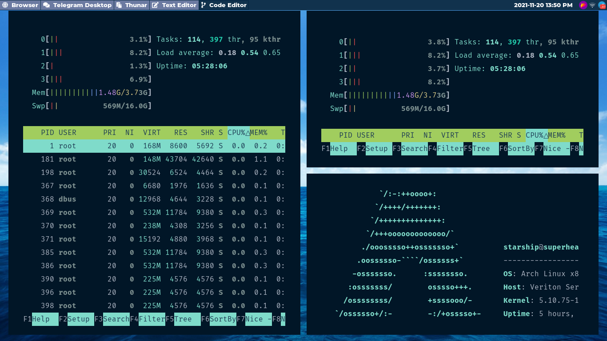
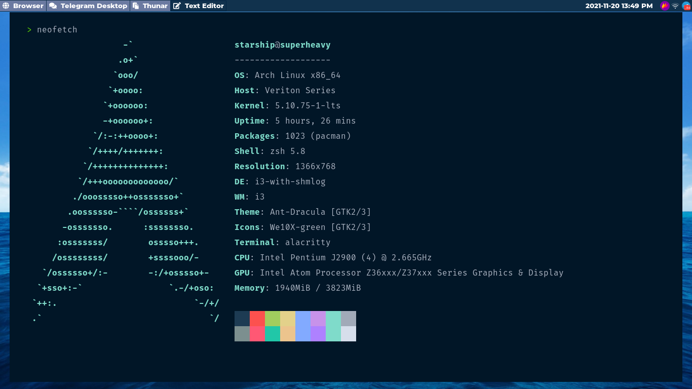

## Dotfiles for arch + i3wm

	** Contains most of my config files 
	** uses i3wm with i3-gaps as the window manager
	** bare minimum setup without any bloatware found in Gnome or KDE environments
	** Fast and resource efficient
	** can be used with ubuntu too

### Programs used

	  * Brave-Browser
	  * Alacritty
	  * Gnome-Terminal
	  * Thunar file manager
	  * Xarchiver
	  * Gparted
	  * LightDM and LightDM webkit2 greeter
	  * Glorious webkit greeter theme
	  * Gedit text editor
	  * Balena Etcher
	  * Pulseaudio and ALSA mixer
	  * Rofi
	  * Polybar
	  * Gnome tweaks
	  * Lxappearance
	  * Pavucontrol
	  * Flameshot screnshot editor
	  * Telegram Desktop
	  * VScodium
	  * i3wm i3bar i3status i3-gaps
	  * Vnc viewer
	  * Transmission gtk
	  * Virtualbox
	  * Neovim
	  * Midori
	  * Git
	  * Nightfly alacritty and vscodium theme
  

